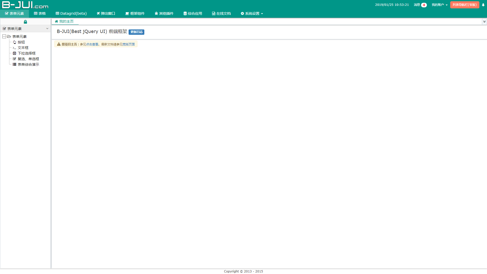

## 介绍

jquery快速开发框架

````
原项目许久不再维护，未对IE11/Edge等浏览器进行兼容测试，请慎重选择本框架。

本项目仅提供项目演示与个人部分修改
````

## [项目演示](https://jzaaa.github.io/BJUI/)

## 主题
本项目新增了一个主题，点击右上方树形按钮选择`Material-Blue`


### 自定义主题
可以配置`BJUI/themes/material_blue/variables.less` `@coreColor`色值配置自己颜色风格的页面

## [更新日志](./CHANGELOG.md)


## 使用

- clone 项目
````
git clone git@github.com:JZaaa/BJUI.git 
````
- 在服务器下访问index.html查看项目演示
- `BJUI`目录为本项目生产文件

--------------------------------------------------

本项目为B-JUI2.x的插件更新版，原框架地址为 http://www.b-jui.com/

## 兼容性

- IE9.0+, Chrome[最佳], Firefox, Safari。
- 本框架不适用于需要兼容IE8以下的开发者或使用者。


## 其他

- 原框架地址:http://www.b-jui.com/

## 修改插件

修改B-JUI分模块并测试后，可通过 ``uglifyjs`` 压缩合并文件,以下为``uglifyjs3``压缩方法

````
// 全局安装uglifyjs
npm install uglify-js -g

// 压缩(在BJUI/js目录下,请备份原bjui-all.js文件)
uglifyjs bjui-core.js bjui-regional.zh-CN.js bjui-frag.js bjui-extends.js bjui-basedrag.js bjui-slidebar.js bjui-contextmenu.js bjui-navtab.js bjui-dialog.js bjui-taskbar.js bjui-ajax.js bjui-alertmsg.js bjui-pagination.js bjui-util.date.js bjui-datepicker.js bjui-ajaxtab.js bjui-datagrid.js bjui-tablefixed.js bjui-tabledit.js bjui-spinner.js bjui-lookup.js bjui-tags.js bjui-upload.js bjui-theme.js bjui-initui.js bjui-plugins.js -c -m -o bjui-all.js
````
